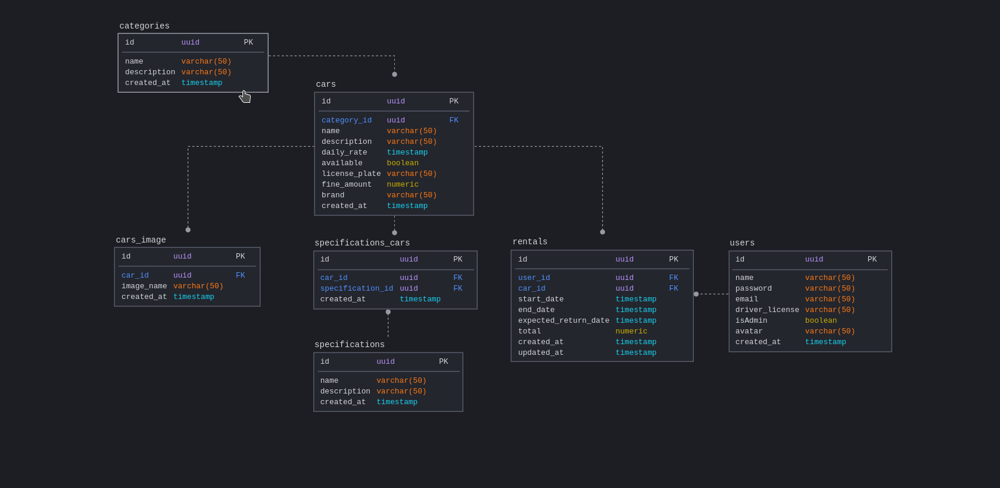

# Rentx

  Rentx é uma **API Rest** para um sistema de aluguel de carros desenvolvido durante o treinamento intensivo de NodeJS da Rocketseat.

  Os requisitos funcionais da aplicação podem ser acessados no link [requisitos](/assets/Requisitos.md).

## Documentação

O Sistema possui documentação em **Swagger** e pode ser testado no link [Rentx](https://rentx.johnlager.com/api-docs/).

  
## Tecnologias utilizadas

**Plataforma:** NodeJS

**Linguagem de programação:** Typescript

**Framework**: Express

**Persistência de dados**: Postgres e Redis no Docker

**ORM**: TypeORM

**Testes**: Jest e Supertest

**Injeção de dependencias**: TSyringe

**Segurança:** Bcrypt, JWT e rate-limiter-flexible

**Upload de arquivos:** Multer

**Hospedagem:** AWS EC2, Nginx, Certbot, PM2 e Google Domains

**Storage:** S3 Bucket

**Code linter:** eslint e prettier

## Modelagem do sistema

## Feedback

Todo feedback é bem vindo, se tiver alguma sugestão é só em entrar em contato! :-)

  